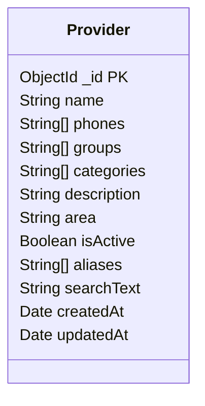

# ERD — Database Part

في نطاق المشروع الحالي، الـ Provider هو الـ collection الأساسية. `groups` و `categories` مخزنين كـ arrays من Strings داخل الـ Provider لتقليل التعقيد، ولا توجد علاقة ObjectId أو Category collection منفصلة.



## Provider fields

```text
PROVIDER
-------------------------
_id          ObjectId / PK
name         String / required
phones       String[]
groups       String[]
categories   String[]
description  String
area         String / default: أبو زعبل
isActive     Boolean / default: true
aliases      String[]
searchText   String
createdAt    Date
updatedAt    Date
```

## Categories source

`categories_final.json` يحتوي على مصدر موحد للتصنيفات وربط كل Category بالـ Main Group الخاص بها. الملف يستخدم كمصدر للـ Categories endpoints، بينما الـ Provider نفسه يحتفظ بأسماء الـ groups/categories كـ Strings.
